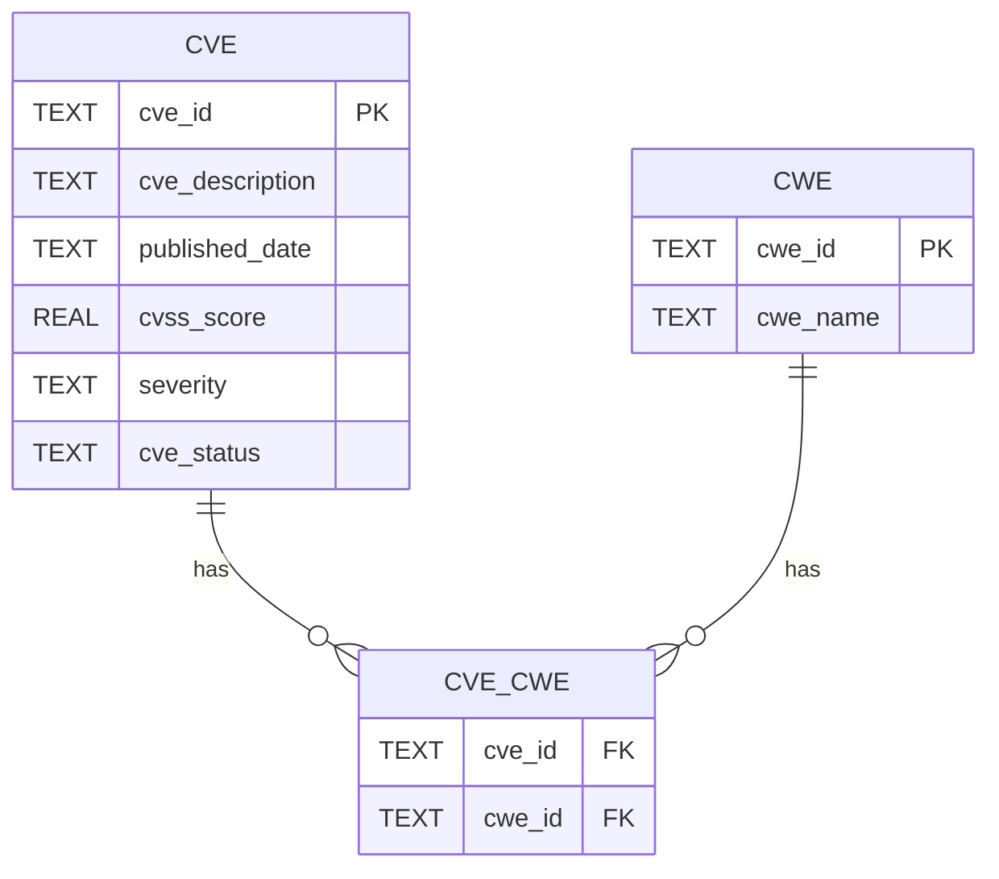

# my_cve_db

## Description
This is the third project as part of a Cyber Security training program.

The goal of the project is the creation of an own database with data about cve.
A source for the data is the national vulnerability database (NVD) from nist.
The collection of these data is running by their API.

One of the project requirements was the integration of an AI assistant. Google Gemini was used to translate natural language input into SQL queries against the database.

With a menu in the terminal it is possible to navigate through the different options:
- update database
- search for cve-id
- filter by severity
- filter by keyword in the description
- show all cve with a given cwe-id
- count cve by severity
- count cve by cwe-id
- create database request with help from ai

## Prerequisites
- Python 3.x
- NVD API Key
- Google Gemini API Key

## Installation
1. Clone the repository
   `git clone https://github.com/Robin4Cybersteps/my_cve_db`
2. Chance Directory `cd ./my_cve_db/`
3. Create virtual environment
   `python -m venv .venv`
4. Activate virtual environment
   - Mac/Linux: `source .venv/bin/activate`
   - Windows:
      - PowerShell: `.\.venv\Scripts\activate`
      - CMD: `.venv\Scripts\activate.bat`
5. Install dependencies
   `pip install -r requirements.txt`
6. Configure .env (see Configuration)
7. Run `python main.py`

## Configuration
1. open the .env.example
2. insert your own API Keys
   - (NVD)[https://nvd.nist.gov/developers/request-an-api-key]
   - 2.2 (Gemini)[https://aistudio.google.com/]
3. remove the .example from the filename

## How to use
a. run `python main.py` or `python3 main.py` in the project root directory

Then the menu appears in your terminal and you can use it.
At the first start the app will create a file my_own_cve.db and fill it with data from nvd.
This will take several seconds, it will get the entries for the last 120 days.
There is a delay of 6 seconds per 2000 entries because the nvd API is restricted.

### Table-structure
I choose a structure with three tables because
- normalisation: no duplicates, each cwe is saved once
- many-to-many: one cve can have many cwes and one cwe can be part of many cves. A junction table is the connector.
- extensibility: The vendor table was intentionally excluded to keep the scope manageable (KISS principle).

## Project structure
| File | Description |
|------|-------------|
| `main.py` | Entry point, menu |
| `db_connector.py` | Database connection |
| `db_reader.py` | Read queries |
| `db_writer.py` | Write queries |
| `nvd_client.py` | NVD API client |
| `ai_translator.py` | Gemini AI integration |
| `helpers.py` | Output formatting |
| `schema.sql` | Database schema |
| `cwe_list.csv` | CWE names (MITRE v4.19.1) |
| `.env.example` | Example of .env |

## Challenges & Learnings
In the beginning I forgot the initial commit on the main branch, so my first
feature branch became my main branch. After a failed workaround I initialized
a fresh git repository to work in a clean way.

As someone who recently presented on CWE-89 (SQL Injection), I wanted to create
database requests in a safe and clean way. At the point of implementing
AI-generated SQL requests I reached the limits of a shorthand Pydantic whitelist.
I chose a simpler approach with basic SELECT validation to make COUNT, GROUP BY
and multi-table queries possible without huge effort – keeping it stupid simple
for a project of this scope.